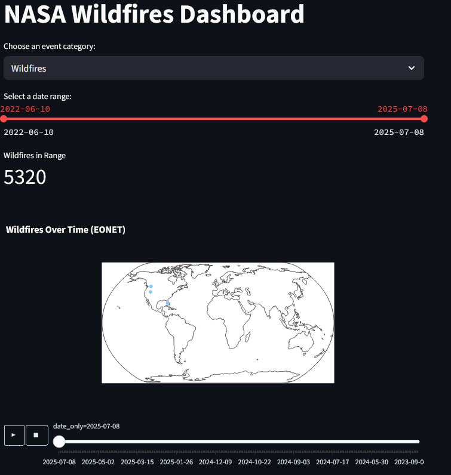

# NASA Natural Events Dashboard

This interactive dashboard uses data from NASA's EONET API to visualize global natural events — including wildfires, storms, volcanoes, and more. Built with Python and Streamlit, it features animated maps, data filtering, and downloadable datasets.

## Features

- Pulls live disaster data from NASA's EONET API
- Interactive map with animation over time
- Filter by event type and date range
- View events as a chart or raw data table
- Download filtered results as CSV
- Built using Python, pandas, Plotly, and Streamlit

## Preview


## Tech Stack

- Python
- Streamlit
- Plotly Express
- pandas
- NASA EONET API

## How to Run

1. Clone the repo or download the files
2. Install dependencies:

```bash
pip install -r requirements.txt
streamlit run wildfire_dashboard.py

EONET/
├── eonet_logger.py            # Collects and stores NASA event data
├── eonet_events.csv           # Cleaned dataset
├── wildfire_dashboard.py      # The interactive Streamlit app
├── README.md                  # This file
└── requirements.txt           # All dependencies


---

## requirements.txt

Now generate this file to list your dependencies:

### Option A: Auto-generate (in your terminal):
```bash
pip freeze > requirements.txt
